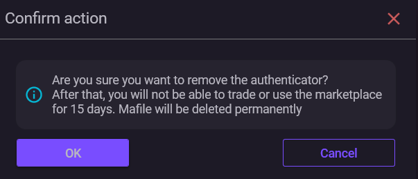

# Removing Steam Guard

Removing deletes the Steam mobile authenticator from the account.

After the operation is completed, Steam Guard stops working, and a trade hold is applied to the account.

***

### Condition before launch

Removing requires a **revocation code (RCode)**.

It is automatically stored in the **maFile** when linking or transferring Steam Guard.

If the RCode is missing, removing through NebulaAuth will not be possible.

***

### How to perform removal

1. Select the account
2. Click **Account → Remove**
3. Confirm the action

If the operation is successful:

* Steam Guard will be removed
* a hold on trades and the market will be applied, **15 days**
* the maFile will be moved to the `maFiles_removed` folder

More details: [Trade hold](../steam-info/trade-hold.md)

***

### If it did not work

Try:

* checking the account session
* performing **Login Again**
* repeating the removal

If the maFile is lost or the RCode in it is invalid, contact Steam Support to restore access to the account.

***

### Deleting an account, maFile

Deleting an account in NebulaAuth is a separate action.

When deleting:

* the maFile is moved to the `maFiles_removed` folder
* the account disappears from the list

**Important**

This is **not removing Steam Guard**.

If the account is still linked, it can be restored by importing the maFile back.

***

### How to delete an account

1. Select the account
2. Menu → **Delete**
3. Confirm the action

***

### ❓ Frequently asked questions

<strong>Why is the "Remove" button unavailable?</strong>

The button becomes active only if `revocation_code` is present in the selected maFile.

<strong>Can I remove Steam Guard if there is no password and the session has expired?</strong>

No.

An active account session is required for removal through NebulaAuth.

If there is no session, use the RCode through "Forgot password" on the Steam website or contact support.

<strong>What should I do if both the maFile and the RCode are lost?</strong>

Contact Steam Support.

To restore access, you will need to confirm ownership of the account, purchases, payments, and so on.

<strong>Can I remove Steam Guard if the account is blocked?</strong>

It depends on the type of block.

* with a trade ban or VAC ban, yes
* with a red table warning, no, no account data can be changed.

