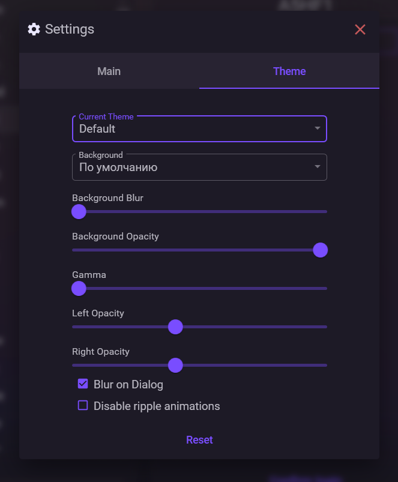
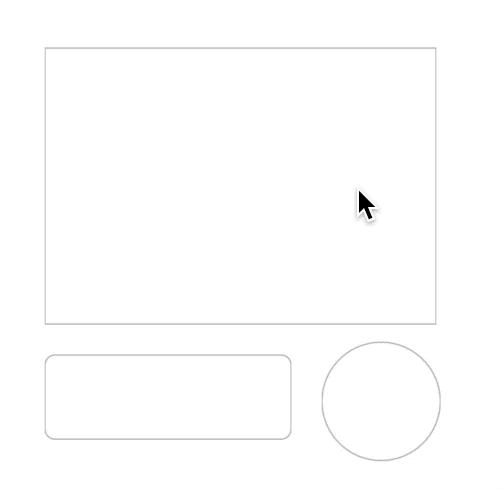

# Appearance

In NebulaAuth, you can customize the interface appearance: theme, background, and transparency.

***

## Themes

Several design themes are available:

* Default
* Black
* Light
* Luxury
* Shadcn

You can choose any theme in the settings.

***

## Background

You can choose one of the modes:

* standard background
* custom background
* solid color, without an image

For a custom background:

* the file must be named **Background.png**
* the file must be located in the program folder, next to `NebulaAuth.exe`
* custom background mode must be selected in the settings

***

## Transparency and effects

You can configure the transparency and visual effects of the interface:

* background blur
* transparency
* brightness, gamma
* transparency of individual panels

Additional options are also available:

* blur when opening dialog windows, which blurs the background behind modal windows
* disable Ripple animation, which removes the press effect on interface elements

***

#### Reset settings

The reset button restores visual settings to their default values.

The theme and background mode do not change.

***

#### ❓ Frequently asked questions

<strong>Do effects affect performance?</strong>

High blur values and animations can reduce performance, especially on weak systems.

To improve performance:

* disable background blur
* disable Ripple effects

