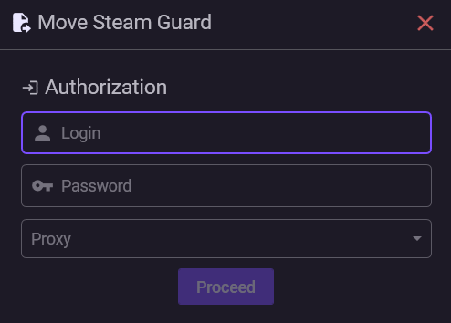

# Transferring Steam Guard

If Steam Guard is activated on a smartphone or another device, you can transfer it to NebulaAuth without needing to disable Steam Guard. In that case, a short 2-day delay will be applied _(More details:_ [trade-hold.md](../../steam-info/trade-hold.md "mention")_)_

It is important to understand that this is not copying, but specifically a transfer. After the process is complete, Steam Guard will stop working on the previous device.

The transfer is performed through the official Steam mechanism.

### ✅ Requirements

Before starting, make sure that:

* mobile Steam Guard is active on the account, in the Steam mobile app or another application
* a **phone number is linked** to the account
* you have **access to the phone** to receive SMS
* you know the **login and password** of the account


**Important**

If a **phone number is not linked** to the account, the transfer is impossible. First link the number through the Steam mobile application or on the Steam website.


### 🧭 Transfer process

#### Step 1: Launch the transfer wizard

1. In the top menu, click **Account → Transfer Steam Guard**
2. The transfer wizard window will open

***

#### Step 2: Log into the account

Enter the login details:

* **Login** — the name of the Steam account
* **Password** — the password for the account
* **Proxy** (optional) — the selected proxy will be used during the transfer process

Click **Continue**.

***

#### Step 3: Steam Guard code from the phone

Steam will request the current Guard code:

1. Open **Steam Guard** on your phone
2. Find the **5-digit confirmation code**; it updates every 30 seconds
3. Enter the code in NebulaAuth
4. Click **Continue**

> You can also confirm the login on the mobile device.\
> In this case, click **Continue** without entering the code.

***

#### Step 4: SMS code

An SMS with a confirmation code will be sent to the linked phone number.

1. Enter the SMS code
2. Click **Continue**

Several attempts are available. If the code does not fit, the application will prompt you to enter a new one.

***

#### Step 5: Done

The transfer is complete. The screen will display:

* **R-code (Revocation Code)** Write it down and store it in a safe place _(best of all on paper)_
* **SteamID** — the account identifier

The maFile has been created and added to the account list. Now you can receive Guard codes and confirm actions directly from your computer.

### 🔄 What happens to Guard on the phone?

After the transfer:

* Guard on the phone **stops working**
* old codes will no longer fit
* the new Guard works only in NebulaAuth, or in another application if you copy the new maFile

### ✅ Transfer completed, what's next?

After the transfer, the account will appear in the list on the left.

In the following sections, you can learn about the main features of the application:

* [interface.md](../interface.md "mention") — the main interface elements and their purpose
* [first-steps.md](../first-steps.md "mention") — a quick start for receiving codes and confirming actions

### ❓ Frequently asked questions

<strong>Can I transfer Steam Guard without a phone number?</strong>

No.

The phone number is a mandatory requirement for transfer through the official Steam mechanism.

<strong>If I had a 15-day trade delay, will it become 2 days after the transfer?</strong>

No.

Trade holds run in parallel and do not stack.

If the account already has a hold, for example 15 days, the transfer will not increase it, but it also will not reduce the total period.

➡️ As a result, the hold with the longest duration applies

More details: [**Trade hold**](../../steam-info/trade-hold.md)

<strong>Can I use Guard on the phone and in NebulaAuth at the same time?</strong>

No.

Transfer is not copying, but recreating the maFile.

After the process is complete:

* Guard on the phone stops working
* codes from the old device become invalid

