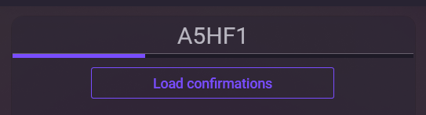
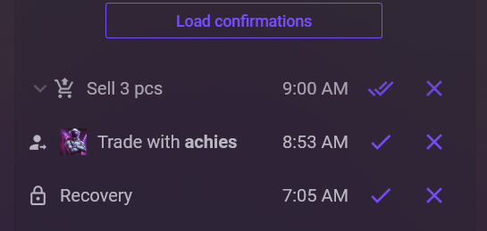

# First steps

This section introduces the main NebulaAuth features. You will learn how to get login codes, confirm trades, and approve logins on other devices.

## 🔐 Getting a login code

Logging in with a Steam Guard code is Steam's standard two-factor authentication flow. The code is generated from the secrets stored in the maFile and refreshes every 30 seconds.


You do not need an internet connection to generate codes.


To get a code:

1. Select the account in the list on the left
2. The Guard code appears on the right side of the window
3. Click the code to copy it

The code updates every 30 seconds. The indicator under the code shows the time until the next update.

***

### 🔁 Confirming trades and sales

Confirmations appear **only after an action** that requires them, such as selling an item on the Market or sending a trade.

1. Perform the action in Steam, such as a trade or sale
2. Select the account in NebulaAuth
3. Click **Load confirmations**
4. Confirmation cards appear below
5. Click ✔️ (**Confirm**) or ✖️ (**Reject**)

## 📱 Confirming login on another device

If you are logging into Steam from a new computer or browser:

1. Enter your login and password in Steam
2. Open NebulaAuth
3. Select the account
4. Click **Confirm login**
5. Return to the browser or Steam application; authentication will complete automatically


The **"Confirm login"** button only works with one login request at a time. If multiple login attempts are detected, the request will be rejected. This does not necessarily mean someone is trying to access your account; it usually means several login attempts happened within a short period.


## 🚀 What's next?

You now know the basics of working with NebulaAuth.

Next, we recommend reading:

* [proxy](../features/proxy/ "mention")
* [auto-confirmations.md](../features/auto-confirmations.md "mention")
* [groups.md](../features/groups.md "mention")
* [settings](../features/settings/ "mention")

If you have questions, check the [solving-problems.md](../support/solving-problems.md "mention") section or ask in our [Telegram community](https://t.me/nebulaauth_chat).
