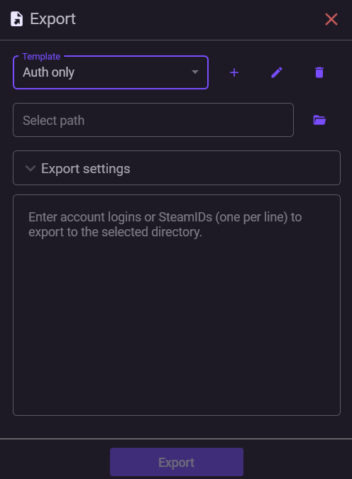

# Экспорт мафайлов

В NebulaAuth можно быстро экспортировать maFile в нужную папку, указав список аккаунтов и выбрав необходимые параметры.

Это полезно, когда нужно перенести аккаунты в другой экземпляр приложения, сделать резервную копию или подготовить файлы для работы в других инструментах.

Чтобы не настраивать экспорт каждый раз заново, в NebulaAuth используются шаблоны.

***

### Что такое шаблон

Шаблон — это предустановка, которая определяет:

* какие поля включать в экспорт
* куда сохранять файлы
* как формировать имена файлов

Вы можете создавать и сохранять шаблоны с собственными названиями для удобства.

***

### Как выполнить экспорт

1. Откройте **Меню → Другое → Экспорт**
2. Выберите шаблон/нужные поля
3. Укажите список аккаунтов (логины или SteamID, по одному в строке)
4. Выберите папку назначения
5. Запустите экспорт
6. Найденные аккаунты будут скопированы в выбранную папку

***

### Настройка полей

При настройке шаблона вы можете выбрать, какие данные включать в maFile:

* основные поля (`shared_secret`, `identity_secret`, `revocation_code`)
* данные сессии
* дополнительные поля maFile
* поля NebulaAuth (`Proxy`, `Group`, `Password`)
* формат имени файла (по SteamID или логину)

Чтобы узнать, что именно экспортируется и зачем это поле нужно, наведите курсор на поле и дождитесь подсказки.

Подробнее: [mafile-technical.md](../steam-info/mafile/mafile-technical.md "mention")

***

#### Ограничения

* экспорт в папки NebulaAuth (`maFiles`, `maFiles_removed`, `maFiles_backup`) запрещён
* если файл с таким именем уже существует — он НЕ будет перезаписан
* экспортированные файлы без основных полей не будут работать в NebulAuth, так как она требует наличие всех основных данных для корректной работы

***

### Частичный экспорт (обрезанный maFile)

Иногда используется так называемый **обрезанный maFile**.

Это файл, в котором есть только:

* логин аккаунта
* `shared_secret`

Такой maFile:

* позволяет генерировать коды для входа
* **не даёт доступа к подтверждениям и Steam Guard**


**Даже обрезанный maFile не является полностью безопасным.**

Не передавайте такие файлы людям, которым не доверяете.\
Их можно использовать для нежелательной активности (например, вход в аккаунт, спам или другие действия).


***

### Результат экспорта

После завершения вы получаете отчёт:

* сколько аккаунтов экспортировано
* сколько не найдено
* сколько конфликтов возникло
