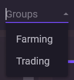

# Группы аккаунтов

Группы помогают объединять аккаунты по назначению и быстрее работать с ними в списке.

С помощью групп можно:

* фильтровать аккаунты
* выполнять массовые действия
* быстрее находить нужные аккаунты

Один аккаунт может принадлежать только одной группе.

***

### Добавление аккаунта в группу

**Вариант 1: Через контекстное меню**

1. Нажмите ПКМ по аккаунту
2. Выберите **Группы → Создать группу**
3. Введите название группы

***

**Вариант 2: Через поле «Группа»**

1. Выберите аккаунт
2. Введите название группы в поле **«Группа»**
3. Нажмите **Enter**

Если группа с таким названием уже существует, аккаунт будет добавлен в неё.

***

### Удаление аккаунта из группы

Чтобы убрать аккаунт из группы:

1. Нажмите ПКМ по аккаунту
2. Выберите **Удалить из группы**

***

### Как удалить группу

Группа существует, пока в ней есть хотя бы один аккаунт.

Чтобы удалить группу, удалите из неё все аккаунты. После этого группа исчезнет автоматически.

***

### Хранение

Группа сохраняется внутри **maFile**, так же как и прокси.

Это означает, что при переносе файла между разными экземплярами NebulaAuth группа сохранится вместе с аккаунтом.
