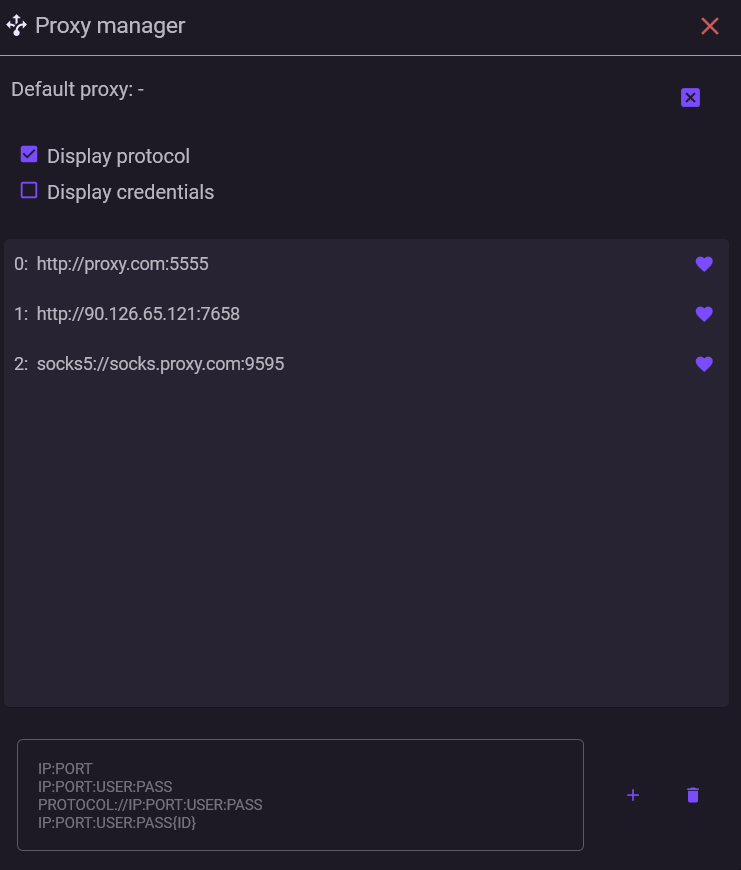

# Менеджер прокси

Менеджер прокси открывается через Меню **→ Менеджер прокси**



***

### ⚙️ Возможности

В менеджере прокси вы можете:

* добавлять прокси
* удалять прокси
* назначать прокси по умолчанию
* копировать прокси (полностью или только адрес)

***

### ✏️ Ввод прокси

Поддерживаемые форматы:

```id="proxy-formats"
IP:PORT
IP:PORT:USER:PASS
USER:PASS@IP:PORT
protocol://IP:PORT
protocol://USER:PASS@IP:PORT
```

По умолчанию используется протокол **HTTP**.


Для прокси типа **SOCKS4 / SOCKS5** необходимо явно указывать протокол (например: `socks5://IP:PORT`).


***

#### 🆔 Использование ID

При добавлении прокси можно указать ID в фигурных скобках:

```id="kq7s2p"
IP:PORT:USER:PASS{0}
```

ID используется для удобства управления прокси: он позволяет быстро идентифицировать прокси по номеру.

Все строки должны содержать ID и быть уникальными. Если указанный ID уже существует — соответствующий прокси будет **перезаписан**.

***

#### 🌐 Прокси по умолчанию

Вы можете назначить прокси по умолчанию.

Он используется как резервный вариант: если у аккаунта не задан свой прокси, запросы будут выполняться через него. Если не задан ни прокси у аккаунта, ни прокси по умолчанию — запросы идут напрямую.

```
прокси аккаунта → прокси по умолчанию → напрямую
```

Прокси по умолчанию нужен в тех случаях, когда вы хотите контролировать сетевые запросы и избежать работы без прокси.

Если удалить прокси, назначенный по умолчанию, приложение перестанет его использовать и будет работать напрямую (если у аккаунтов нет своих прокси).


Если нужно полностью исключить прямые соединения, можно указать заведомо нерабочий прокси (например, `0.0.0.0:5555`).

В этом случае аккаунты с назначенным прокси будут работать как обычно, а остальные не смогут выполнять запросы напрямую.


***

### ❓ Частые вопросы

<details>

<summary><strong>Что произойдёт, если удалить прокси из менеджера?</strong></summary>

Прокси не удаляется из maFile.

Аккаунт сохранит привязку, но при выборе данного аккаунта будет отображаться красный значок "Используется прокси из мафайла". Чтобы полностью отвязать прокси, нужно удалить привязку с самого аккаунта.

</details>

<details>

<summary><strong>Где хранятся прокси?</strong></summary>

Прокси из менеджера хранятся в файле `proxies.json` в корне папки приложения. Привязка прокси к аккаунту сохраняется в maFile этого аккаунта.

</details>

<details>

<summary><strong>Можно ли импортировать прокси из файла?</strong></summary>

Прямого импорта нет, но вы можете легко добавить прокси из любого текстового файла:

1. Откройте файл с прокси
2. Скопируйте список
3. Вставьте в менеджер прокси

</details>

<details>

<summary><strong>Можно ли экспортировать прокси?</strong></summary>

Прямого экспорта нет, но вы можете легко скопировать прокси из менеджера:

1. Нажмите ПКМ на нужный прокси
2. Выберите “Скопировать” или “Скопировать адрес”

</details>

<details>

<summary><strong>Можно ли редактировать прокси?</strong></summary>

Прямого редактирования нет, но вы можете легко перезаписать прокси с помощью функции добавления (указав тот же ID)

</details>

<details>

<summary><strong>Есть ли ограничение на количество прокси?</strong></summary>

Нет.

Вы можете добавить любое количество прокси.

</details>

***

В следующем разделе мы рассмотрим, как использовать добавленые прокси в работе с аккаунтами


[usage.md](usage.md)

