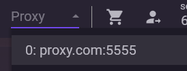

# Использование прокси в аккаунтах

### Назначение прокси



Чтобы назначить прокси аккаунту:

1. Выберите нужный аккаунт
2. В поле **«Прокси»** сверху выберите нужный прокси из выпадающего списка

При переключении между аккаунтами вы будете видеть назначенный прокси.

Прокси сохраняется внутри **maFile**, поэтому при переносе файла между разными экземплярами NebulaAuth он также сохранится.

***

### Где используется прокси

Прокси применяется при работе аккаунта:

* авторизация и сессия
* подтверждения
* автоподтверждения

***

### Удаление прокси из аккаунта

Чтобы отвязать прокси от аккаунта:

**Способ 1:**

1. Нажмите на поле **«Прокси»**
2. Нажмите клавишу **DEL**

**Способ 2:**

1. Нажмите ПКМ по аккаунту
2. Выберите **«Отвязать прокси»**

После этого аккаунт будет использовать прокси по умолчанию (если он задан) или работать напрямую.

***

### Прокси по умолчанию

Если у аккаунта не назначен собственный прокси, используется прокси по умолчанию.

```
прокси аккаунта → прокси по умолчанию → напрямую
```

Это позволяет задать общее поведение сети и избежать работы без прокси.

***

### Использование при привязке и переносе

При **привязке аккаунта** или **переносе Steam Guard** можно выбрать прокси из списка.

Выбранный прокси:

* используется во время выполнения операции
* автоматически сохраняется в созданном maFile

***

### Индикаторы в интерфейсе

В интерфейсе отображаются состояния прокси:

* красный — если прокси используется из аккаунта, но отсутствует в менеджере
* жёлтый — если аккаунт работает через прокси по-умолчанию
