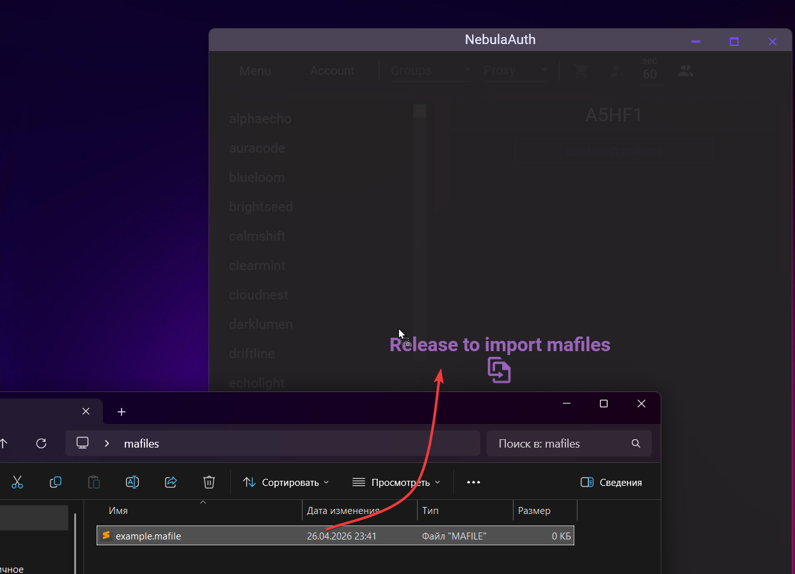
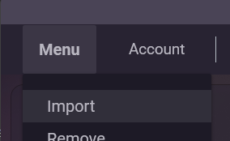

# Импорт мафайлов

Импорт — самый простой способ добавить аккаунты в NebulaAuth. Если у вас уже есть готовые мафайлы (например, из старого Steam Desktop Authenticator или другого приложения), вы можете быстро перенести их в приложение.

***

### Способы импорта

#### 1️⃣ Перетаскивание (Drag & Drop)

Самый быстрый вариант:

1. Откройте папку с мафайлами
2. Выделите нужные файлы (или все сразу)
3. Перетащите их прямо в окно NebulaAuth

Приложение автоматически распознает формат и добавит аккаунты.

***

#### 2️⃣ Вставка из буфера обмена (Ctrl + V)

Быстрый способ для тех, кто предпочитает клавиатуру:

1. Выделите файлы в проводнике
2. Нажмите **Ctrl + C**
3. Перейдите в окно NebulaAuth
4. Нажмите **Ctrl + V**

Все скопированные мафайлы будут добавлены автоматически.

***

#### 3️⃣ Через меню «Файл»

Классический способ, подходит для добавления одного файла:

1. Нажмите **Файл → Импорт**
2. Выберите файл `.maFile`
3. Нажмите **Открыть**

### Дополнительная информация

#### 🔒 Зашифрованные maFile (миграция с SDA)

NebulaAuth поддерживает импорт **зашифрованных maFile**, созданных в Steam Desktop Authenticator (SDA).

Если ваши файлы зашифрованы, при импорте приложение автоматически предложит ввести **пароль шифрования**, который вы использовали в SDA.


После успешного импорта maFile будут сохранены **в расшифрованном виде**.

В текущей версии NebulaAuth шифрование maFile не поддерживается.


### Как проходит импорт

1. Начните импорт maFile в NebulaAuth
2. При появлении запроса введите пароль шифрования от SDA
3. Дождитесь завершения импорта

После этого аккаунты будут добавлены и готовы к использованию.

### &#x20;Импорт завершён — что дальше?

После импорта аккаунтов он появится в списке слева.

В следующих разделах вы можете ознакомиться с главными функциями приложения:

* [interface.md](../interface.md "mention") — основные элементы интерфейса и их назначение
* [first-steps.md](../first-steps.md "mention") — быстрый старт для получения кодов и подтверждения действий

### ❓ Частые вопросы

<strong>Что делать, если файл уже существует?</strong>

Если в папке `maFiles` уже есть файл с таким же **именем**, приложение предложит выбрать действие:

* **Перезаписать** — заменить существующий файл новым
* **Пропустить** — оставить существующий файл, новый не добавлять

Если импортируется несколько файлов, выбранное действие будет применено ко всем конфликтам.

<strong>Почему maFile не импортируется?</strong>

Проверьте следующее:

* расширение файла — **`.maFile`**
* файл открывается в текстовом редакторе и содержит **валидный JSON**

Также убедитесь, что в файле присутствуют обязательные поля:

* `shared_secret`
* `identity_secret`
* `device_id`
* `account_name`

Если эти условия не выполняются, файл не будет распознан как валидный мафайл.

<strong>Совместимы ли maFile со Steam Desktop Authenticator (SDA)?</strong>

Да, maFile полностью совместимы.

Файлы из SDA можно импортировать в NebulaAuth, а также использовать в других совместимых приложениях.

