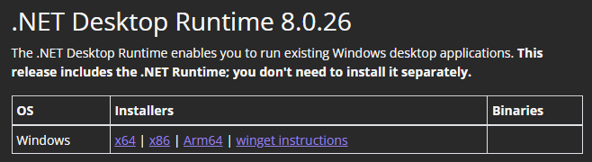
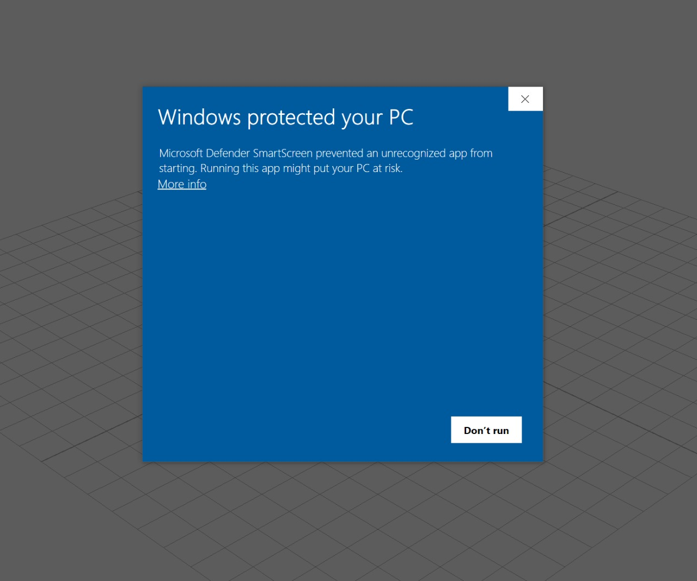

# Установка

Этот раздел поможет вам установить **NebulaAuth** за несколько минут

***

## 💻 Системные требования

Для работы **NebulaAuth** требуется:

* .NET Desktop Runtime 8.0 (x64)
* Windows 7 и выше

_Linux и macOS официально не поддерживаются, подробнее можно прочитать в разделе_ [https://github.com/achiez/nebula-docs-temp/blob/master/quick-start/unix-support.md](https://github.com/achiez/nebula-docs-temp/blob/master/quick-start/unix-support.md "mention")_._

***

## Установка и первый запуск

### 🧩 Шаг 1: Установка .NET

Для работы с NebulaAuth требуется установленный **.NET**

1. Перейдите на [страницу загрузки](https://dotnet.microsoft.com/en-us/download/dotnet/8.0)
2.  Найдите раздел **.NET Desktop Runtime 8.0.**\*

    <figure><figcaption></figcaption></figure>
3. Выберите и скачайте версию **x64**
4. Запустите установщик и завершите установку, следуя инструкциям мастера

***

### ⬇️ Шаг 2: Скачивание и запуск

1.  Перейдите в официальный репозиторий на Github и скачайте файл NebulaAuth.zip с последней версией приложения:

    [github.com/achiez/NebulaAuth-Steam-Desktop-Authenticator-by-Achies](https://github.com/achiez/NebulaAuth-Steam-Desktop-Authenticator-by-Achies/releases/latest)
2. Распакуйте архив в любую свободную папку
3. Запустите файл **NebulaAuth.exe**


Скачивайте приложение **только** из официального GitHub-репозитория. Версии из сторонних источников могут быть модифицированы и представлять угрозу безопасности ваших аккаунтов.


***

### 🛡 Шаг 3: Windows SmartScreen

При первом запуске Windows может отобразить предупреждение **«Windows защитила ваш компьютер»**

Чтобы продолжить запуск:

1. Нажмите "Подробнее"
2. Нажмите **Выполнить в любом случае**

<figure><figcaption></figcaption></figure>

Это стандартное поведение Windows для приложений без цифровой подписи и не указывает на наличие вредоносного кода.

## Что дальше?

Готово, теперь у вас установлено и запущено приложение NebulaAuth. В следующем разделе [add-account](add-account/ "mention") вы узнаете, как добавить свои Steam-аккаунты в приложение и начать работу с ними.
