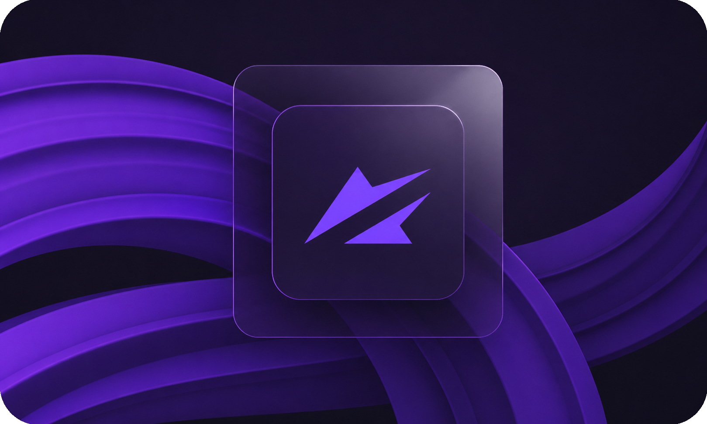

# Документация



NebulaAuth — это приложение, которое заменяет мобильное приложение Steam\* при работе со Steam Guard.

Вы можете получать коды, подтверждать действия и управлять аккаунтами без телефона — быстрее и удобнее.

<a href="getting-started/installation.md" class="button primary">Приступить к настройке</a>



<figure><figcaption></figcaption></figure>



_<mark style="color:$info;">\*NebulaAuth не является официальным продуктом Valve и не аффилирован с Valve Corporation или Steam.</mark>_

## 🚀 С чего начать

<table data-view="cards"><thead><tr><th></th><th></th><th data-hidden data-card-target data-type="content-ref"></th></tr></thead><tbody><tr><td>⚡ <strong>Быстрый старт</strong></td><td>Установка, запуск и добавление первого аккаунта</td><td><a href="getting-started/installation.md">installation.md</a></td></tr><tr><td>🔐 <strong>Привязка и перенос</strong></td><td>Подключение Steam Guard или перенос с другого устройства</td><td><a href="getting-started/add-account/">add-account</a></td></tr><tr><td><strong>❓Устранение ошибок</strong></td><td>Решение типичных проблем, которые возникают в процессе работы</td><td><a href="support/solving-problems.md">solving-problems.md</a></td></tr><tr><td>🤖 <strong>Автоматизация</strong></td><td>Автоподтверждения и работа в фоне</td><td><a href="features/auto-confirmations.md">auto-confirmations.md</a></td></tr><tr><td>🧾 <strong>maFile</strong></td><td>Что это такое и как с ним работать</td><td><a href="steam-info/mafile/">mafile</a></td></tr><tr><td>⚙️ <strong>Настройки</strong></td><td>Настройка поведения и внешнего вида приложения</td><td><a href="features/settings/">settings</a></td></tr></tbody></table>

***

### Что умеет NebulaAuth

NebulaAuth объединяет основные задачи работы со Steam Guard в одном месте:

* создание/перенос Steam Guard на аккаунте
* управление множеством аккаунтов
* автоматическое подтверждение действий
* работа с прокси

Переосмысление SDA

NebulaAuth вдохновлён Steam Desktop Authenticator (SDA) и развивает его идеи.

В процессе разработки стало понятно, что существующих возможностей недостаточно для более сложных сценариев работы, поэтому NebulaAuth предлагает расширенный функционал и более удобный подход к управлению аккаунтами.

### Безопасность и контроль

NebulaAuth не изменяет данные аккаунта и не хранит информацию на внешних серверах.

Это open-source проект — вы можете ознакомиться с кодом и проверить, как работает приложение.

Все данные остаются у вас:

* maFile хранится локально
* пароли можно зашифровать
* вы полностью контролируете доступ

Приложение работает локально и не требует сторонних сервисов

Приложение не выполняет сторонних сетевых запросов, кроме:

* Steam — для работы с аккаунтом
* GitHub — для проверки обновлений (установка по желанию)

#### Официальные ресурсы

Для обеспечения стабильной работы, безопасности и доступа к актуальным обновлениям рекомендуется использовать только официальные и проверенные источники.

* [💻 **Официальный репозиторий**](https://github.com/achiez/NebulaAuth-Steam-Desktop-Authenticator-by-Achies/)
* [🚀 **Последний релиз**](https://github.com/achiez/NebulaAuth-Steam-Desktop-Authenticator-by-Achies/releases/latest)
* [📢 **Официальный Telegram-канал (RU)**](https://t.me/nebulaauth)
* [**💬 Чат сообщества**](https://t.me/nebulaauth_chat)
* [🧩 **.NET 8 Desktop Runtime**](https://dotnet.microsoft.com/en-us/download/dotnet/8.0)

***

#### Важно

Данная документация является официальной документацией NebulaAuth.

При этом она может обновляться, изменять структуру или быть перенесена на другой домен без отдельного уведомления.\
Рекомендуется использовать GitHub-репозиторий проекта как основной и наиболее актуальный источник информации и обновлений.
