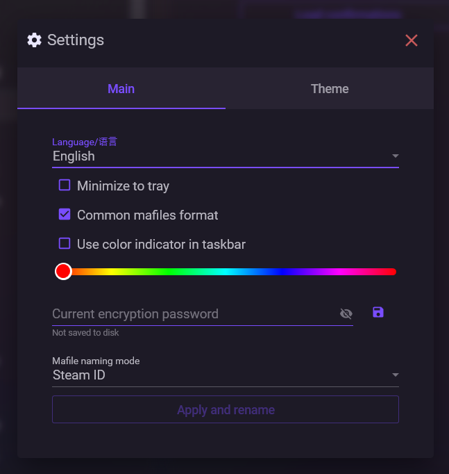
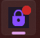

# Основные параметры

В этом разделе находятся основные параметры NebulaAuth, которые влияют на поведение приложения.

***

## Язык

Вы можете выбрать язык интерфейса:

* English
* Русский
* Українська
* 简体中文
* Français
* Español
* Türkçe
* Қазақша

Язык можно изменить в настройках без перезапуска и без редактирования файлов.

***

## Скрывать в трей

При включении окно приложения сворачивается в системный трей.

***

## Общепринятый формат mafile

(Включено по умолчанию)

При включении NebulaAuth сохраняет maFile в формате, совместимом с Steam Desktop Authenticator (SDA).

При отключении используется собственный формат NebulaAuth.

Не рекомендуется отключать эту опцию, так как многие сторонние инструменты ожидают именно совместимый формат.

***

## Индикатор в панели задач

Добавляет цветной индикатор на иконку приложения в панели задач.

Это удобно при работе с несколькими окнами NebulaAuth — позволяет быстро отличать экземпляры.

***

## Пароль шифрования

Позволяет задать пароль шифрования для сохранённых паролей аккаунтов.

Введите пароль и нажмите **Сохранить**, чтобы включить защиту.

Чтобы удалить пароль — очистите поле и сохраните изменения.

Подробнее: [Сохранение паролей](../session/saving-password.md)

***

## Имена maFile

Определяет, как формируются имена файлов:

* по SteamID
* по логину аккаунта

После изменения нажмите кнопку "Применить".

В процессе:

* создаётся резервная копия всех мафайлов в `maFiles_backup`
* файлы переименовываются
* показывается результат (успешно, конфликты, ошибки)
