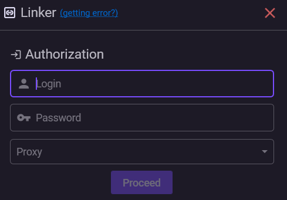

# Привязка аккаунта

Если на вашем Steam-аккаунте никогда не был включён мобильный Steam Guard, или вы отключили его, вы можете привязать новый Steam Guard прямо через **NebulaAuth**.

***

### ✅ Требования

Перед началом убедитесь, что:

* у аккаунта **нет активного мобильного Steam Guard**
* у вас есть **доступ к почте**, привязанной к аккаунту
* вы знаете **логин и пароль** от Steam-аккаунта


**Задержка обменов**

После привязки нового Steam Guard ваш аккаунт начнёт отсчёт задержки на обмены в **7 дней**. Для новых аккаунтов, задержка будет до **15 дней**.

Подробнее: [trade-hold.md](../../steam-info/trade-hold.md "mention")


### 🧭 Процесс привязки

#### Шаг 1: Запуск мастера привязки

1. В верхнем меню нажмите **Аккаунт → Привязать**
2. Откроется окно мастера привязки

***

#### Шаг 2: Вход в аккаунт

Введите данные для входа:

* **Логин** — имя Steam-аккаунта
* **Пароль** — пароль от аккаунта
* **Прокси** (опционально) — выбранный прокси будет использован в процессе привязки

Нажмите **Продолжить**.

***

#### Шаг 3: Код с почты (если включён почтовый Guard)

Если на аккаунте включён почтовый Steam Guard, на почту придёт код подтверждения.

1. Введите код
2. Нажмите **Продолжить**

Если почтовый Guard не был включён — этот шаг пропускается автоматически.

***

#### Шаг 4: Номер телефона (опционально)

Steam может предложить ввести номер телефона. На данный момент **это не обязательно**.

Возможные варианты:

* **Ввести номер телефона** → потребуется подтверждение по SMS
* **Пропустить шаг** → код подтверждения придёт на почту

***

#### Шаг 5: Подтверждение

Дальнейшие действия зависят от предыдущего шага:

* если вводили номер телефона — введите **SMS-код**
* если номер пропущен — введите **код с почты**

Если номер телефона **уже был привязан к аккаунту ранее**, код подтверждения всегда приходит **по SMS**, даже если шаг с номером был пропущен.

***

#### Шаг 6: Готово

Привязка завершена. На экране появится:

* **R-код (Revocation Code)** Запишите его и сохраните в надёжном месте _(лучше всего — на бумаге)_
* **Имя файла** — под этим именем мафайл сохранён в папке `maFiles`


NebulaAuth автоматически создаёт резервную копию мафайла в папке `maFiles_backup`. Это дополнительная защита на случай потери основного файла или сбоя в процессе привязки


Мафайл автоматически добавляется в список аккаунтов. Теперь вы можете получать Guard-коды и, после временного трейдбана, начать подтверждать действия с предметами.

### ⚠️ Что делать, если возникла ошибка?

Иногда процесс привязки может завершиться ошибкой. Чаще всего встречаются сообщения вида:

* `BadConfirmationCode`
* `InvalidState`
* «Код не подошёл»

Это **известный баг на стороне Steam** и не является ошибкой нашего приложения.

***

### 🔧 Решение

_Следуйте шагам в точности_

Если ошибка появилась — выполните шаги **строго по порядку**:

1. **Начните процесс привязки заново**
2. Введите логин и пароль
3. При запросе номера телефона — введите любой реальный номер телефона
4. Перейдите по ссылке из письма на почте
5. Нажмите **Продолжить**

Дальше возможны два сценария:

**Сценарий A: Появилась ошибка** Если появилась любая ошибка — переходите к шагу 6

**Сценарий B: Запрос SMS-кода** Если система запросила SMS:

* ❗ **Не вводите SMS-код**
* Закройте окно привязки
* Подождите 20 минут, чтобы Steam сбросил состояние

6. После этого проблема должна исчезнуть
7. Повторите процесс привязки обычным способом


После **3–5 неудачных попыток** Steam может заблокировать привязку на срок от **1 дня до недели**.

Если ошибка появилась — **не продолжайте вслепую**, а сразу используйте инструкцию выше.


***

#### Почему это работает?

Это известная особенность в логике Steam. Когда вы проходите процесс с номером телефона, Steam снимает внутреннюю «блокировку», и последующая привязка становится возможной.

### ✅ Привязка завершена — что дальше?

После привязки аккаунт появится в списке слева.

В следующих разделах вы можете ознакомиться с главными функциями приложения:

* [interface.md](../interface.md "mention") — основные элементы интерфейса и их назначение
* [first-steps.md](../first-steps.md "mention") — быстрый старт для получения кодов и подтверждения действий

### ❓ Часто задаваемые вопросы

<strong>Можно ли привязать аккаунт, если Steam Guard уже включён на другом устройстве?</strong>

Нет.

Если мобильный Steam Guard уже активен, используйте [**перенос Steam Guard**](transfer.md).

Если вы хотите привязать Guard заново:

1. Отключите текущий Steam Guard
2. Дождитесь окончания кулдауна (**15 дней**)
3. После этого выполните привязку через NebulaAuth

<strong>Почему запрашивается SMS-код, если я не вводил номер телефона?</strong>

Возможные причины:

* номер телефона уже привязан к аккаунту
* номер был введён ранее — Steam может сохранять его в течение **20–30 минут**

В таком случае:

* подождите некоторое время
* повторите процесс привязки

<strong>Я получаю ошибку LimitExceeded или другие ошибки после нескольких попыток</strong>

Steam ограничивает количество попыток привязки.

После нескольких неудачных попыток может быть установлен временный блок:

* от **24 часов** до **нескольких дней**

Рекомендуется:

* прекратить попытки
* подождать
* затем повторить процесс, строго следуя инструкции выше

<strong>Я выполнил инструкцию по исправлению бага, но ошибка всё равно появляется</strong>

Некоторые аккаунты могут быть более чувствительны к этому поведению Steam.

В этом случае рекомендуется:

1. Перейти на официальный сайт Steam через браузер
2. Привязать номер телефона вручную
3. После этого вернуться в NebulaAuth и завершить привязку через SMS

