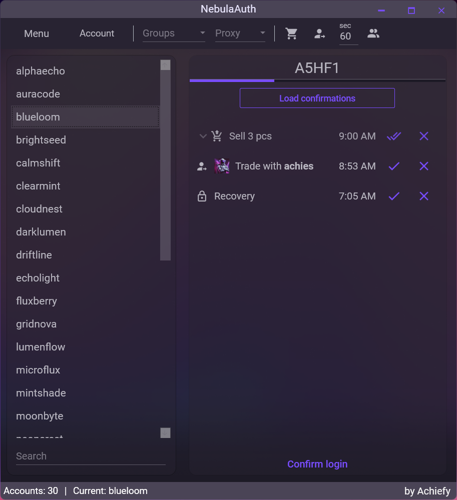
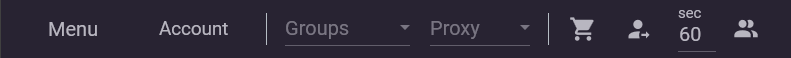
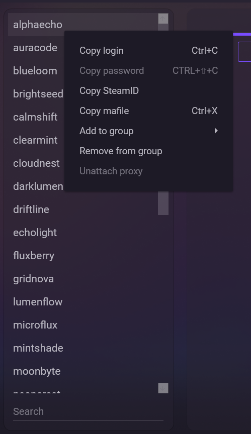
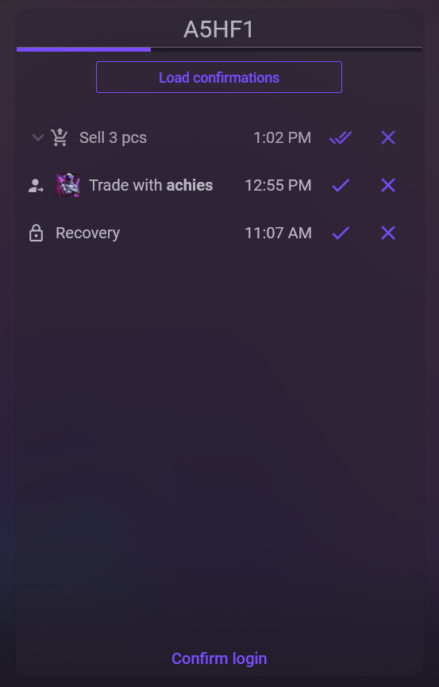

# Обзор интерфейса

После запуска NebulaAuth вы увидите главное окно приложения. Оно разделено на несколько логических частей — каждая отвечает за свою задачу. Ниже разберём их по порядку.

***

## 🧭 Панель управления (верхняя часть)

В верхней части окна находится панель с меню и элементами управления.

### Меню

Здесь собраны основные действия, связанные с мафайлами и настройками приложения:

* **Импорт** — добавить мафайлы в приложение
* **Удалить** — удалить выбранный мафайл из NebulaAuth
* **Открыть папку** — открыть папку, где хранятся мафайлы
* **Менеджер прокси** — открыть управление прокси
* **Настройки** — изменить язык, внешний вид и поведение приложения

В подразделе **«Другое»** доступны дополнительные функции:

* **Установить пароли** — задать пароли сразу для нескольких аккаунтов
* **Экспорт** — сохранить мафайлы в другую папку или с нужными параметрами

***

### Меню «Аккаунт»

Это меню отвечает за действия со Steam-аккаунтами:

* **Привязать** — создать новый Steam Guard для аккаунта
* **Перенести Steam Guard** — перенести Guard с телефона на компьютер
* **Отвязать** — полностью удалить Steam Guard с аккаунта
* **Обновить сессию** — попробовать обновить сессию аккаунта без пароля
* **Войти заново** — повторно войти в аккаунт, если сессия устарела

***

### Группы

Поле для выбора или создания групп аккаунтов.

Если у вас много аккаунтов, вы можете объединить их в группы (например: «Основные», «Фарм», «Трейд»).

* При выборе группы в списке отображаются только аккаунты из неё
* Чтобы создать новую группу — введите её название и нажмите **Enter**

Подробнее: [groups.md](../features/groups.md "mention")

***

### Прокси

Здесь выбирается и отображается прокси, связанный с текущим аккаунтом. Чтобы назначить прокси, его нужно сначала создать в **Менеджере прокси** (кнопка в меню). После создания он появится в этом списке.

Рядом с полем может отображаться индикатор состояния:

* **Жёлтый кружок** — используется прокси по умолчанию
* **Красный кружок** — прокси указан в мафайле, но отсутствует в приложении

При наведении курсора на индикатор появится подсказка с подробной информацией.

Подробнее: [proxy](../features/proxy/ "mention")

***

### Таймеры автоподтверждений

Два переключателя отвечают за автоматические подтверждения:

* **"Тележка"** — подтверждение продаж и покупок на торговой площадке Steam
* **"Человек со стрелочкой"** — подтверждение обменов

Рядом находится поле с интервалом проверки (в секундах). Приложение будет проверять наличие новых подтверждений с заданной периодичностью.

> При клике правой кнопкой по переключателям можно включить таймеры для всей группы аккаунтов или сразу для всех аккаунтов.

Подробнее: [auto-confirmations.md](../features/auto-confirmations.md "mention")

***

### Показать аккаунты с автоподтверждением

Кнопка с иконкой **Accounts** справа.

Если включена — в списке аккаунтов отображаются только те аккаунты, у которых активны автоподтверждения.

***

## 👥 Список аккаунтов (левая часть)

В левой части окна отображаются все добавленные аккаунты. Каждый аккаунт показывается под своим логином

В нижней части списка находится поле поиска. Вы можете искать аккаунты по логину или SteamID (начинается с `76...`).

***

### Контекстное меню аккаунта

При клике правой кнопкой мыши по аккаунту открывается меню:

* Скопировать логин
* Скопировать пароль
* Скопировать SteamID
* Скопировать мафайл
* Добавить в группу
* Убрать из группы
* Открепить прокси

***

## 🔐 Коды и подтверждения (правая часть)

Правая часть окна позволяет взаимодействовать с выбранным аккаунтом.

***

### Код подтверждения

В верхней части отображается текущий Guard-код. Нажмите на него, чтобы скопировать.

Под кодом расположен индикатор времени, показывающий, сколько секунд осталось до обновления. Код меняется каждые 30 секунд.

***

### Загрузить подтверждения

Кнопка для получения подтверждений с серверов Steam.

> Подтверждения появляются **только после действия**, которое их требует (обмен, продажа и т.п.).

После загрузки ниже появятся карточки подтверждений, которые можно принять или отклонить.

***

### Подтвердить вход

Кнопка в нижней части панели.

Используется для подтверждения входа в Steam с нового устройства:

* если есть **один** запрос — вход подтверждается сразу
* если запросов **несколько** — кнопка ничего не делает

В этом случае рекомендуется подтвердить вход вручную через список подтверждений.

***

## ℹ️ Нижняя панель

Внизу окна отображается служебная информация:

* количество загруженных аккаунтов
* имя выбранного аккаунта
* ссылка **by achies** — официальный источник и автор проекта

***

## Что дальше?

Теперь, когда вы знакомы с интерфейсом, можно перейти к изучению основных функций приложения.

Для начала работы с аккаунтами рекомендуем ознакомиться с разделами:


[first-steps.md](first-steps.md)



[proxy](../features/proxy/)

